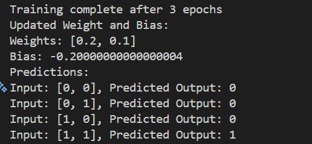
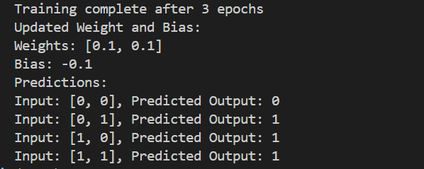
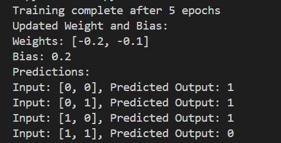
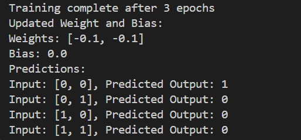
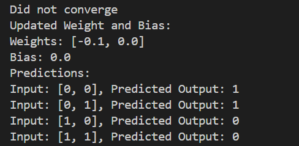

# Perceptron from Scratch – Logic Gates

This project demonstrates the implementation of a **single-layer Perceptron from scratch** using pure Python (no machine learning libraries).  

## Objective

- Implement a perceptron without using ML libraries
- Train the same algorithm on multiple logic gates
- Observe convergence behavior
- Understand why **XOR cannot be learned** by a single perceptron

## Results

### AND Gate

### OR Gate

### NAND Gate

### NOR Gate

### XOR Gate 

## Conclusion
It shows how single layer Perceptron is implemented from scratch
It shows the limitation of single perceptron 
 - Learning Non-linear function is a problem shown using XOR Gate
